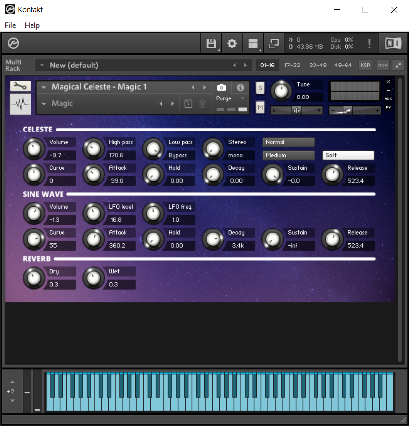

# Magical Celeste

I think that ever since I heared ["Hedwig's Theme"](https://youtu.be/I35XMs5J7II) for the first time I have been curious as to what instrument it really is that plays the melody. I've heard [celeste](https://www.vsl.co.at/en/Percussions/Celesta) mentioned numerous times, but most samples of a celeste didn't sound quite like the Harry Potter score. I stumbled accross [a really interesting analysis](https://filmmusicnotes.com/2013/04/13/john-williams-themes-part-6-of-6-hedwigs-theme-from-harry-potter/) of the theme that also mentioned that the sound is electronically manipulated. Some further digging 

